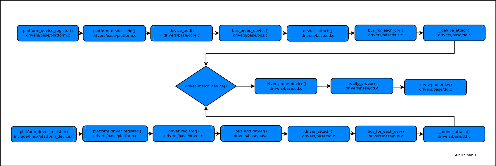

## Linux Device Model

The goal of this project was to create a bus driver similar to a platform bus/device/driver. It covers the internals of match() and probe() functions. 
This sample code is compiled against Linux Kernel 5.1 version. 

### Custom Bus

The source code defined a custom bus, a custom device and a custom driver. It is similar to a platform driver virtual bus. The bus has two important functions (match and probe). 
When a custom_device is registered, it's bus attribute points to "struct bus_type custom_bus". 
On the other side when the custom_driver is registered, the bus_add_driver() eventually calls the custom bus probe function from where the custom_driver.probe function is called. 

Will add details later on the series of function calls.

 

